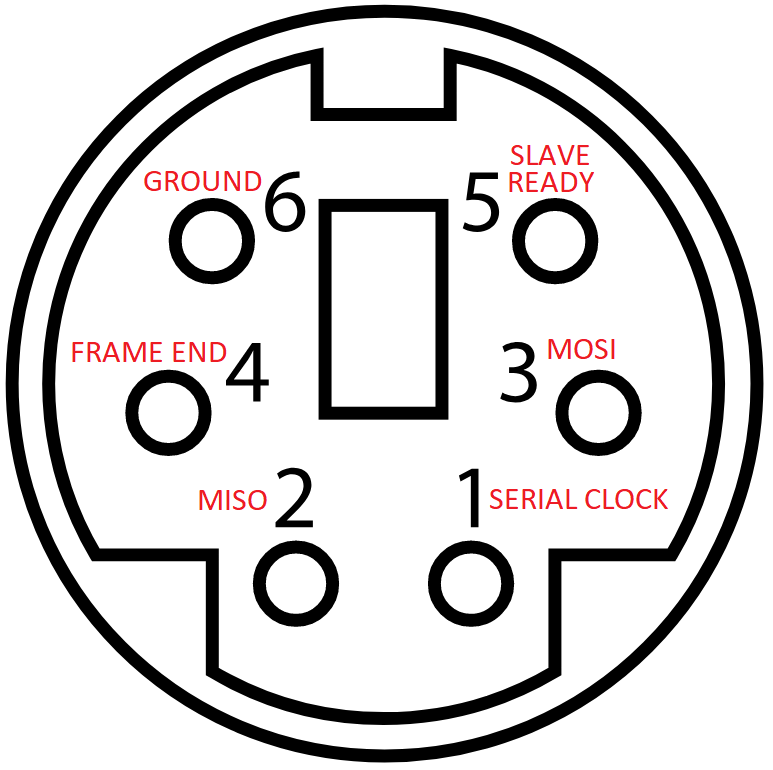
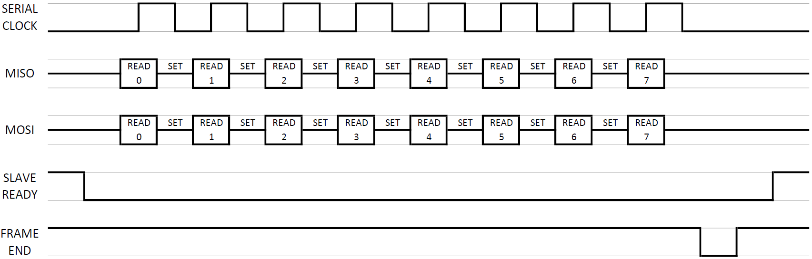

# Rokenbok Smart Port Documentation

## Introduction

The first generation Rokenbok RC command deck featured an expansion port known as the “Smart Port.” Patent documents indicate that the company had intended to develop peripherals capable of interfacing through the port. Unfortunately these plans never materialized and the port was removed from subsequent generations of the RC command deck. More than two decades later the functionality of the port is now understood and peripherals have been develop to interface with the command deck.

## Smart Port Basic Functionality

The command deck actually has four virtual controllers in addition to the four physical controllers that can be plugged into the command deck. The basic purpose of the Smart Port is to manipulate these four virtual controllers. The microcontroller onboard the command deck stores the current vehicle selection value and button states for each of the eight controllers. An external peripheral can use the smart port to manipulate these values directly. As such, the smart port can actually override the physical controllers and manipulate all eight controllers. Additionally, Rokenbok had plans to create controllers that could select up to 16 vehicles. While this controller never materialized, the functionality existed on the command deck microcontroller and can be exploited by the smart port.

## The Smart Port Connector

The Smart Port connector on the command deck closely resembles the PS/2 connector found on older mice and keyboards. While the connector is the same (female Mini DIN-6), the pinouts and communication protocols are entirely different. The protocol is similar to SPI but with two extra pins. In the serial communication the command deck functions as the master and the peripheral is the slave. Pin 1 is the serial clock provided by the command deck. Pin 2 is the Master In Slave Out data line provided by the peripheral. Pin 3 is the Master Out Slave In data line provided by the command deck. Pins 1, 2, and 3 are all 5V and active high. Pin 4 is known as the “frame end” pin. It is normally driven high at 12V by the command deck, but is pulled low at the end of each byte transmission by the command deck. It’s really not necessary in the serial communication – normal SPI serial communication does not use this. The slave should know when all 8 bits have been sent because of the clock. The reason why Rokenbok made this line 12V was to provide the peripheral with a source of power. The line is only pulled low less than 5% of the time, so a capacitor can be used to smooth that dip to provide continuous power to the peripheral through a regulator. Pin 5 is the “slave ready” pin. Again, most SPI communication protocols don’t use something like this. However, this line is required to make the connection work. The command deck weakly pulls the line up to 5V. When the peripheral is ready to receive the next byte it simply drives the line low. Once it has received the byte it sets the line back to high while it processes the new data. Pin 6 is simply a common ground between the master and slave.

## Serial Communication

